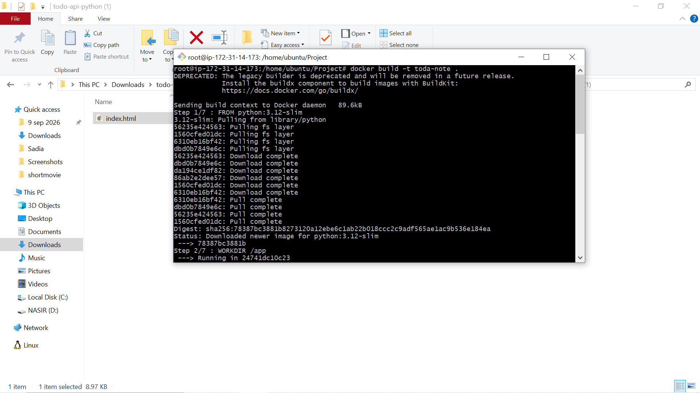
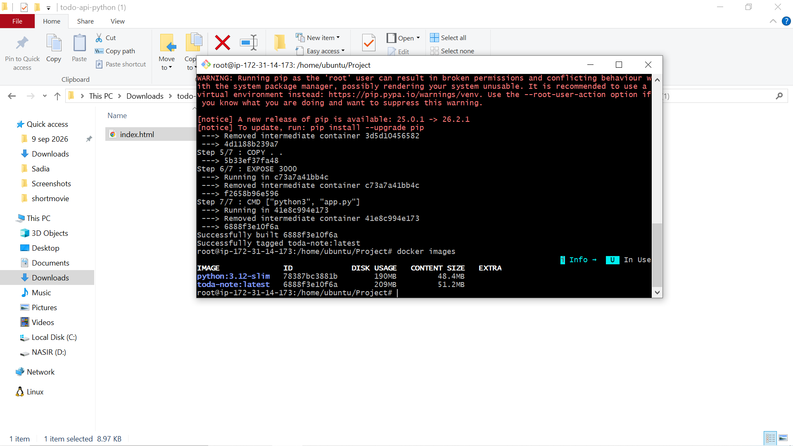
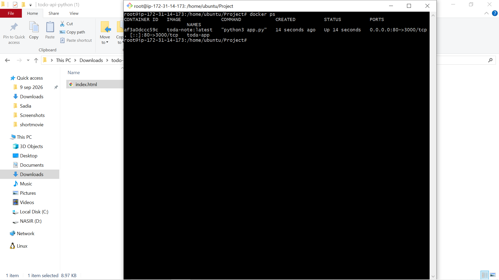
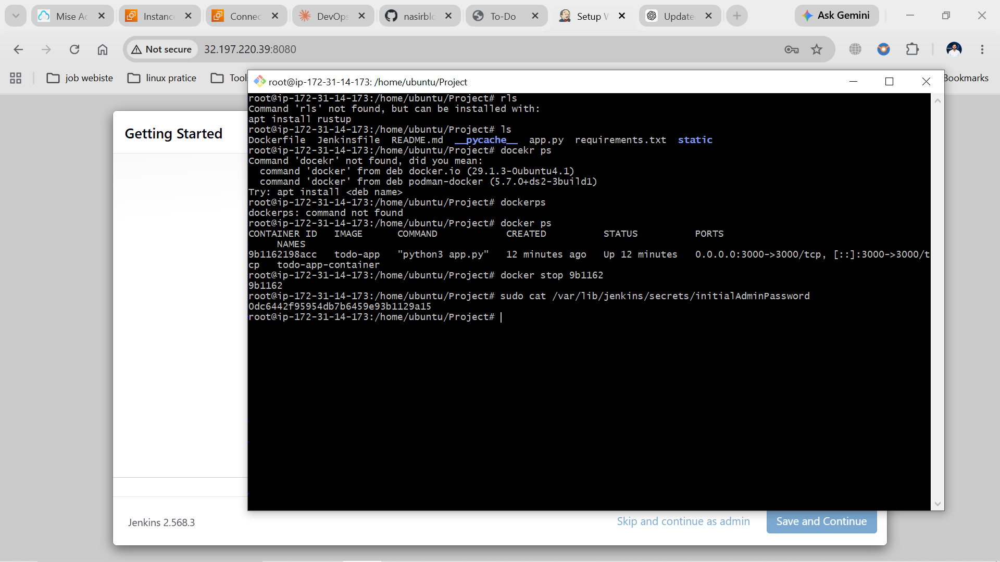
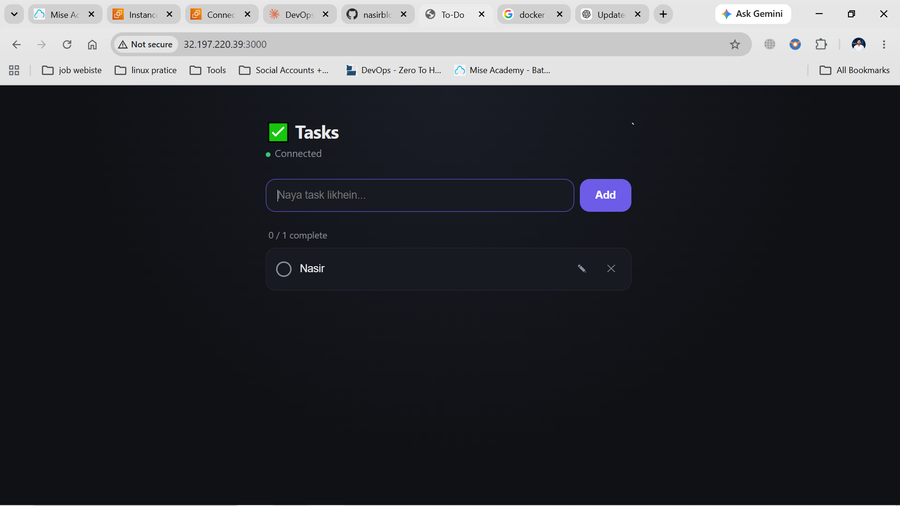
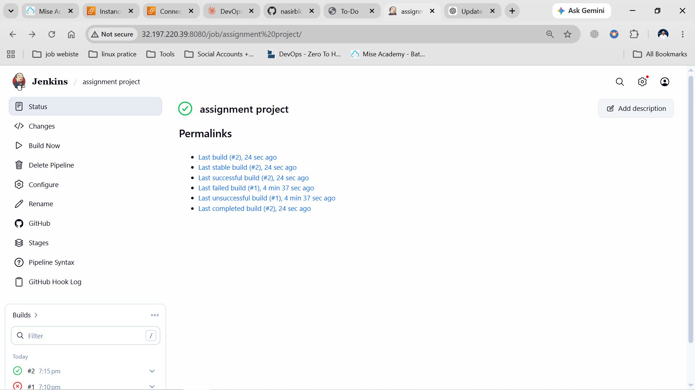
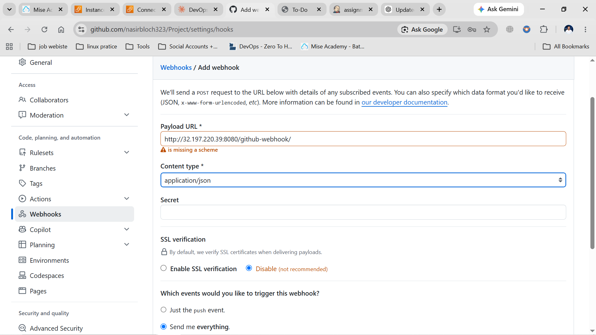

# To-Do API — Flask + Docker + Jenkins CI/CD

A small full-stack to-do list application: a Flask REST API backed by in-memory storage, a vanilla JS front end, containerized with Docker, and deployed automatically through a Jenkins CI/CD pipeline on every push to GitHub.

This project was built as a hands-on exercise covering the full path from code → container → automated build → automated deploy.

---

## Table of Contents

- [Overview](#overview)
- [Tech Stack](#tech-stack)
- [Project Structure](#project-structure)
- [Running Locally (without Docker)](#running-locally-without-docker)
- [Running with Docker](#running-with-docker)
- [API Endpoints](#api-endpoints)
- [CI/CD with Jenkins](#cicd-with-jenkins)
- [GitHub Webhook Setup](#github-webhook-setup)
- [Live Deployment](#live-deployment)
- [Reflection](#reflection)

---

## Overview

The app lets a user create tasks, mark them done, edit their titles, and delete them — a classic CRUD to-do list. What makes this project more than just "a to-do app" is the pipeline around it:

1. Code is pushed to **GitHub**.
2. A **GitHub webhook** notifies **Jenkins** immediately.
3. Jenkins **checks out** the latest code, **builds** a Docker image, and **deploys** it — replacing the previously running container — with zero manual steps.

Data is stored in memory (no database), so it resets whenever the container restarts. That trade-off was intentional — see [Reflection](#reflection) for why.

---

## Tech Stack

| Layer            | Technology                         |
|-------------------|-------------------------------------|
| Backend           | Python 3.12, Flask                  |
| Frontend          | HTML, CSS, vanilla JavaScript (no framework/build step) |
| Containerization  | Docker                              |
| CI/CD             | Jenkins (Pipeline / Jenkinsfile)    |
| Source control    | Git + GitHub                        |
| Trigger           | GitHub Webhook                      |

---

## Project Structure

```
.
├── app.py                # Flask API — all routes and in-memory task storage
├── static/
│   └── index.html        # Front end (fetch calls to the API, no build step)
├── requirements.txt       # Python dependencies
├── Dockerfile             # Container build definition
├── Jenkinsfile             # Jenkins pipeline: checkout → build → deploy
├── screenshots/            # Screenshots referenced in this README
└── README.md
```

---

## Running Locally (without Docker)

```bash
pip install -r requirements.txt
python3 app.py
```

Set a custom port if needed:
```bash
PORT=5000 python3 app.py
```

Open `http://localhost:3000` in a browser.

---

## Running with Docker

### 1. Build the image

```bash
docker build -t todo-api .
```



### 2. Run the container

```bash
docker run -d --name todo-app-container -p 3000:3000 todo-api
```



### 3. Confirm the container is running

```bash
docker ps
```



### 4. List available images

```bash
docker images
```



Once running, open `http://<server-ip>:3000` (or `http://localhost:3000` locally) to use the app.



To rebuild after a code change and force a clean build (skip Docker's layer cache):

```bash
docker build --no-cache -t todo-api .
```

---

## API Endpoints

| Method | Path               | Description                                                              |
|--------|--------------------|---------------------------------------------------------------------------|
| GET    | `/`                | Serves the front end (`static/index.html`).                              |
| GET    | `/health`          | Health check → `{"status": "ok", "service": "todo-api"}`                 |
| GET    | `/tasks`           | Returns all tasks as a JSON array.                                       |
| POST   | `/tasks`           | Creates a task. Body: `{"title": "..."}`. Returns `201`, or `400` if title is missing/blank. |
| PATCH  | `/tasks/<id>`      | Updates `title` and/or `done` for a task. Returns `200`, or `404` if not found. |
| PATCH  | `/tasks/<id>/done` | Marks a task done. Returns `200`, or `404` if not found.                 |
| DELETE | `/tasks/<id>`      | Deletes a task. Returns `200` with `{"deleted": <id>}`, or `404`.        |

**Example:**

```bash
curl -X POST http://localhost:3000/tasks \
  -H "Content-Type: application/json" \
  -d '{"title":"Buy milk"}'

curl -X PATCH http://localhost:3000/tasks/1 \
  -H "Content-Type: application/json" \
  -d '{"done": true}'

curl -X DELETE http://localhost:3000/tasks/1
```

---

## CI/CD with Jenkins

The `Jenkinsfile` defines a pipeline with three stages:

1. **Checkout** — pulls the latest code from GitHub.
2. **Build Docker Image** — runs `docker build`, tagging the image with both the Jenkins build number and `latest`.
3. **Deploy** — stops and removes the previous `todo-app-container` (if running), then starts a new container from the freshly built image on port `3000`, with `--restart unless-stopped`.

After every run, dangling (unused) images are pruned so disk usage doesn't grow unbounded over time.

### Pipeline in action



### Setting it up

1. Install Jenkins on the server and make sure the `jenkins` user has Docker permissions (`sudo usermod -aG docker jenkins && sudo systemctl restart jenkins`).
2. Create a new **Pipeline** job in Jenkins.
3. Under **Pipeline**, choose **"Pipeline script from SCM"** → SCM: **Git** → point it at this repo's URL, branch `main`, script path `Jenkinsfile`.
4. Save, then run **Build Now** to test it manually the first time.

---

## GitHub Webhook Setup

To make Jenkins build and deploy automatically on every `git push`, a webhook connects this GitHub repo to the Jenkins server:

1. In the GitHub repo: **Settings → Webhooks → Add webhook**.
2. **Payload URL:** `http://<jenkins-server-public-ip>:8080/github-webhook/`
3. **Content type:** `application/json`
4. **Which events:** Just the push event.
5. In the Jenkins job config, enable **"GitHub hook trigger for GITScm polling"**.



Once configured, every push to `main` triggers Jenkins automatically — no manual "Build Now" needed.

---

## Live Deployment

The app is deployed on an AWS EC2 instance, built and redeployed automatically by Jenkins on every push. The running container serves the app on port `3000`.

---

## Reflection

**Trickiest part:** it wasn't the app logic — the Flask routes and storage model are simple by design. The trickiest parts were the ones that don't show up just from reading the code: a route handler that had ended up nested inside another function due to a copy/paste indentation slip (which silently broke task creation), a stray control character that crept into the file during a transfer between environments and caused a `SyntaxError` only on deploy, and later a Docker socket permission error (`permission denied ... docker.sock`) where the Jenkins user had been added to the `docker` group but the service hadn't been restarted to pick it up. None of these are visible from a code review — you have to actually run the thing, check logs, or inspect bytes to catch them.

**Why I made the choices I did:**
- **In-memory storage instead of a database** — the scope here is a small CRUD demo and a CI/CD exercise, not a production task manager. A database adds setup overhead (migrations, connection handling, another moving part in the container) without teaching anything new about the API or pipeline design. The trade-off — state resets on restart — is explicit and acceptable for this project's purpose.
- **Vanilla JS front end, no framework** — for a UI this small, a framework means a build step and a heavier image for no real benefit. Plain HTML/CSS/JS keeps the whole thing understandable in one file.
- **Jenkins deploys directly on the same host it builds on** — no registry push, no separate deploy target. This keeps the pipeline simple and matches the scope of the project (single server), though it means the deploy step is tightly coupled to "wherever Jenkins happens to run," which wouldn't scale past one environment.
- **Both `PATCH /tasks/<id>` and `PATCH /tasks/<id>/done`** — the general PATCH is more RESTful and flexible (partial updates to title and/or done in one call), while the `/done` shortcut stayed because it's a simpler, single-purpose endpoint some clients might prefer. No real cost to supporting both.

**With another day, I'd:**
- Swap in-memory storage for SQLite — the single highest-value change, since it would survive container restarts and redeploys without adding real complexity.
- Add an actual test suite (`pytest` + Flask's test client) and run it as a Jenkins stage, instead of relying on manual `curl` checks. Right now the pipeline proves the image *builds and starts*, not that the API *behaves correctly*.
- Push the built image to a registry (Docker Hub or ECR) instead of deploying straight from the Jenkins host — this would decouple "where it's built" from "where it runs" and make it possible to deploy to a different or additional server later.
- Replace Flask's built-in dev server with a production WSGI server (gunicorn) in the Dockerfile — the current setup explicitly warns it isn't production-ready, and it's a five-minute fix.
- Add rollback logic to the Deploy stage — right now, if a bad build gets deployed, there's no automatic way back to the last known-good container.
